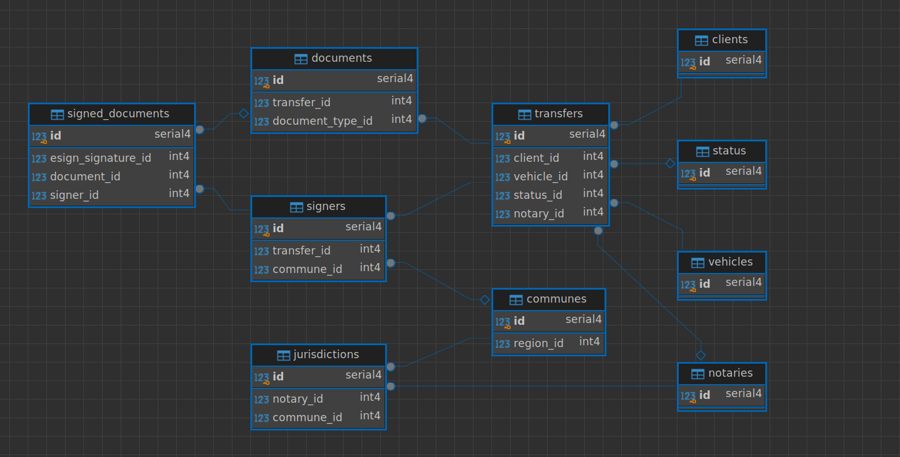

# Prueba Técnica


## Requisitos Previos
  - Buena conexión a internet
  - Deberás compartir pantalla en todo momento
  - Tener instalado `NodeJS` y `npm` para poder ejecutar el proyecto

## Ejercicio 1 - Refactorización de código

En esta prueba técnica, se te proporcionará un código que necesita ser analizado, depurado y optimizado aplicando buenas prácticas de programación.

#### Criterios de evaluación:
   - Eliminar funciones o variables duplicadas.
   - Aplicar funciones flecha (arrow functions).
   - Utilizar `async/await` en lugar de promesas anidadas.
   - Evitar `ifs` anidados y callbacks anidados.
   - Uso de `camelCase` para nombres de variables y funciones.
   - Comentarios claros y concisos donde sea necesario.
   - Código limpio y bien estructurado.
   - Corregir errores para obtener el resultado esperado detallado en la sección de "Funcionamiento esperado".

#### Plus:
   - Utilizar axios para las solicitudes HTTP.
   - Crear test unitarios.


#### Funcionamiento esperado:
Se espera que el código funcione correctamente y devuelva el resultado esperado al ejecutar el endpoint `http://localhost:3000/vehicle-info/:license`

- http://localhost:3000/vehicle-info/AAAA01
```typescript
{
    totalLoss: { 
        status: 'OK', 
        data:   {
            patente: "AAAA01",
            fecha: "2024-04-01",
            status: "NO REGISTRA PERDIDA TOTAL",
        }
    },
    prt: { 
        status: 'OK', 
        data: {
            patente: "AAAA01",
                fecha: "2024-04-01",
            status: "APROBADA",
        },
    },
    fines: { status: 'OK', data: [] },
}
```
- http://localhost:3000/vehicle-info/AAAA00
```typescript
{
    totalLoss: { 
        status: 'NOT_OK', 
        data: {
            patente: "AAAA00",
            fecha: "2024-03-01",
            status: "REGISTRA PERDIDA TOTAL",
        }
    },
    prt: {
        status: 'NOT_OK',
        data: {
            status: "RECHAZADA",
            patente: "AAAA00",
            fecha: "2024-04-01",
        }
    },
    fines: { 
        status: 'NOT_OK', 
        data: [
            {
                patente: "AAAA00",
                fecha: "2024-03-01",
                hora: "12:00",
                lugar: "Concepcion",
                infraccion: "Conducir sin licencia",
                monto: 120000,
        },
        {
                patente: "AAAA00",
                fecha: "2024-05-01",
                hora: "14:00",
                lugar: "Concepcion",
                infraccion: "Conducir en estado de ebriedad",
                monto: 200000,
            },  
        ],
    },
}
```

####  Endpoints disponibles
Estos endpoints simulan un servicio externo y se utilizan para obtener la información necesaria para el informe del vehículo, no se deben modificar.

- http://localhost:3000/total-loss/:license

```typescript
{
    patente: "ABCD12",
    fecha: "YYYY-MM-DD",
    status: "REGISTRA PERDIDA TOTAL" | "NO REGISTRA PERDIDA TOTAL",
}
```

- http://localhost:3000/prt/:license

```typescript
{
    patente: "ABCD12",
    fecha: "YYYY-MM-DD",
    status: "RECHAZADA" | "APROBADA",
}
```

- http://localhost:3000/fines/:license

```typescript
[
    {
        patente: "ABCD12",
        fecha: "YYYY-MM-DD",
        hora: "HH:MM",
        lugar: "LUGAR",
        infraccion: "INFRACCION",
        monto: 000000,
    },
    ..... {}
]
```


## Ejercicio 2 - Modelo de datos ER

Explicar el siguiente modelo de datos ER, las relaciones entre las tablas (1:1, 1:M, M:N) y el porqué de las mismas.


